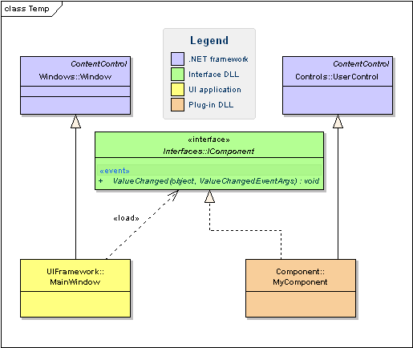
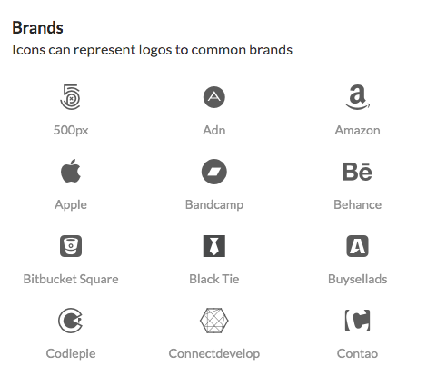
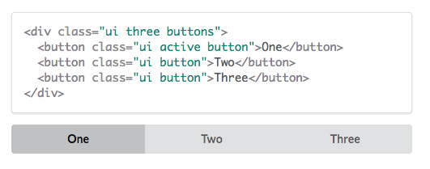

UI Frameworks definitely make life a lot easier. For a developer like me who does not prefer to spend hours and hours on resizing circles or creating icons on Photoshop, UI Frameworks are the way to go. Some popular UI Frameworks include [Twitter Bootstrap](http://getbootstrap.com/2.3.2/), [Materialize CSS](http://materializecss.com/), and [Semantic UI](http://semantic-ui.com/). To start talking about UI Frameworks, it is important to talk about what an UI, what a UI framework is, and what's great about UI Frameworks (in this case for the front-end). Actually, this entire page and site is powered by the UI framework, Semantic UI-- a framework that uses natural language to make code "self-explanatory."

## So what is a UI? 
UI stands for User Interface. UIs are what allows the user and a computer system to interact with each other. Someone who is doing [User Interface Design](https://www.usability.gov/what-and-why/user-interface-design.html) implies that he or she is designing an interface that can allow users or clients to interfact with a system or software easily and intuitively.

## So what are UI Frameworks? 
The technical definition of a framework (or more specifically, a [software framework](http://info.cimetrix.com/blog/bid/22339/What-is-a-Software-Framework-And-why-should-you-like-em)) is similar to a library. A software library contains objects and methods that can be instantiated and used in a custom application. Of course, you need to know which objects to instantiate and which methods to call. A framework, allows the user to implement the objects and methods that are custom to his or her application and they are instantiated and invoked by the framework. This makes life way easier because instead of making objects and icons from scratch, a front-end UI framework can allow users to easily do things like resize images, rotate icons, or divide a page up to columns (or at least with Semantic UI anyway). <br><br>

From the perspective of someone who is purely a software engineer or software developer with minimal design experience, UI frameworks allow users to be able to roll out awesome looking websites and applications without the need to focus on CSS stylesheets too much. This gives software engineers and software developers more time to focus on the pure action, functionality, and features as opposed to worrying about resizing a background image on photoshop and throwing it into the code. <br><br>
Several UI frameworks ui frameworks actually have built-in code for icons to allow users to make social media buttons easily without having the need to worry about resizing the icon on any external photo editor. With one line of code, someone can just make a Facebook icon or Amazon icon easily. The cool thing I have found with certain front-end UI frameworks is that some of them are mobile-responsive, so users will not need to worry about radically changing the content in their code and making three versions of the same site for a desktop computer, a smartphone and an iPad. 

## What is Semantic UI?

I have used a bunch of frameworks here and there but I have never used Semantic UI before taking ICS 314 (Software Engineering). Semantic UI from my experience is an easy-to-use UI framework for the front-end that allows for easy front-end development with its intuitive code base and natural language usage. It is also pretty easy to install on the [NPM](http://semantic-ui.com/introduction/getting-started.html).

## What is this "natural language" you speak of?


One of the things that Semantic UI is known for is natural language. The classes in Semantic UI uses syntax from natural languages like noun/modifier relationships, word order, and plurality to link concepts intuitively. If you want a button, you can just use the ```ui button``` class to create a button. Yep. It's just that easy. Plus it looks pretty nice.

## Learning UI Frameworks 
Like learning a new library or a new programming language, learning a new framework can be extremely hard. It is definitely a struggle to find out which methods lead to what, but so far Semantic UI's idea of having classes using natural language syntax makes it a lot easier to use this framework to its full (or 3/4's) capacity.  
<br>
So why take the time to learn a UI framework? Well, you could argue the time that it takes for a developer to spend on learning a new framework could be the same or less than the time it takes to do the same thing using just pure HTML, CSS, and JavaScript. So ultimately, it all depends on the person. Personally, I am not skilled in Photoshop nor want to muck up things in my stylesheet to fix up an icon or image, so for me, I would want to take the time to learn a UI framework to use less Photoshop as possible.
<br><br>
As a software engineering student that has used Semantic UI and heavy HTML, CSS, and JavaScript in the past for front-end development, I can see why UI frameworks exist. Given the opportunity, I would definitely want to spend the least amount of time as possible on creating a user interface and still want it to look cool and engaging. Semantic UI is something that is definitely useful for front-end development due to how "readable" and "straightforward" the code is thanks to natural language. 

## Conclusion: UI Frameworks. Yay or Nay?
Every software engineer or software developer has an option to either create something from scratch or use an existing library to make things easier. The same goes with UI frameworks. Learning how to use a framework is an important skill to have especially when applying for [internships and jobs](http://tutorialzine.com/2015/12/the-languages-and-frameworks-you-should-learn-in-2016/) where some companies want their employees to know how to use a certain framework-- learning how to use a certain UI framework like Twitter Bootstrap or Semantic UI is not exception. UI frameworks are powerful tools to have and they allow software engineers with little UI design experience to hit the ground running and roll out something amazing in a short amount of time.<br><br>
Creating a UI is not easy work and there are certain situations where a project requires a software engineer to develop something from scratch, but UI frameworks are definitely worth the time and investment. UI frameworks are growing and there are many of them out there. They provide an easy way for a software engineer to convey their work and connect to their audience and clients. UI frameworks connect you and I.
