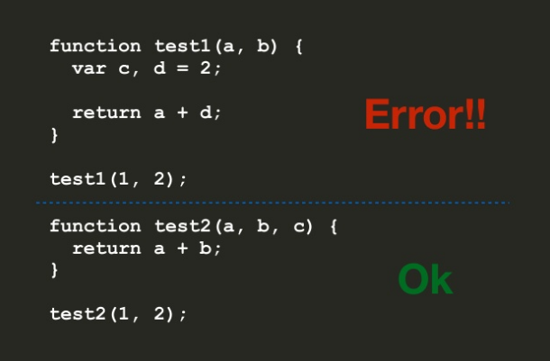
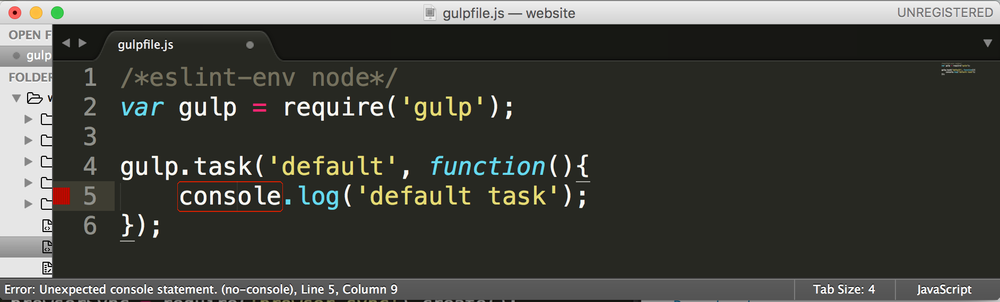

Since I was a freshmen in Computer Science, I've always wondered how people coded "professionally." To elaborate on this question, I was curious as to how the coding conventions I did in school differs from the coding style that professional software engineers and professional software developers have. <br><br>
I knew that it was important to comment my code so that others see what my methods return and whatnot. I also knew that for Java, constants should be in [ALL-CAPS](https://www.java-tips.org/java-se-tips-100019/24-java-lang/802-how-do-i-declare-a-constant-in-java.html) (like ```public static final int SPEED```), and I knew that all "normal" variables start with lower case (like ```public int accelerationRate```). <br><br>
It wasn't until I took ICS 314 (Software Engineering) that I found out about "coding standards" or as I see it: the new, "cool" way to code (and by cool, I mean way people that work at [Google](https://github.com/google/styleguide) and other Fortune 500 companies code). Being able to appeal to industry standards is definitely something I think is important for any Software Engineer or Software Developer. 

## What are "coding standards"?

Coding standards are set rules and conventions that code must follow in order for it to be "standard." Some examples of popular coding standards for JavaScript are [Airbnb's](https://github.com/airbnb/javascript) and [Google's](https://google.github.io/styleguide/jsguide.html) style guides.<br><br>
Some common coding conventions defined in these guides are variable declaration. <br>
For example, in both Airbnb's and Google's JavaScript style guides, it the use of ```var``` and encourages the use of ```let``` for variables that will be reasigned and ```const``` for variables that won't be assigned. <br><br>

## How to use coding standards?
For JavaScript, a coding standard and style guide's rules can be implemented and "enforced" by linting utilities such as [ESLint](http://eslint.org/) and [JSHint](http://jshint.com/). Whenever a piece of code doesn't follow a set style guide's rules, an error or "red-swiggly" will appear (or red box in Sublime Text's case).<br><br>
<br>
These linting utilities can be thrown onto an IDE like [IntelliJ IDEA](https://www.jetbrains.com/idea/) or a text editor like [Sublime Text](https://www.sublimetext.com/). Some IDEs won't allow the code to run if it does not follow the specified coding standard.<br><br>

## How helpful are coding standards?
Based on what I have experienced so far in ICS 314 with coding standards, I definitely feel that coding standards can help a programmer learn a language and utilize that language in the most efficient way possible. <br><br>
Anyone can write a for-loop like ```for (int i = 0; i < someNumber; i++)``` in any programming language like C++ or Java, but certain coding standards and style guide's like [Airbnb's](https://github.com/airbnb/javascript#iterators--nope) discourage the use of iterators and encourage the use of high-order function like ```for-in``` and ```for-of``` to go through arrays and objects. While this may break away from the standard for-loops that other languages like Java and C++ may use, the enforcement of ```for-in``` and ```for-of``` is actually helpful in learning JavaScript. <br><br>
Not only is it less stuff to type but ```for-in``` and ```for-of``` are functions that are unique to JavaScript (though I could be wrong but they're mostly known to be used in JavaScript). By being forced to use high-order functions, I feel that coding standards could actually be helpful because it encourages programmers from different backgrounds to dig deep into the world of JavaScript and explore other high-order functions like ```filter()``` and ```reduce().``` Making standard C++ and Java programmers break away from their normal coding conventions will definitely allow them to experience JavaScript to the fullest.<br><br>

## My ESperience Thus Far...

ESLint was pretty hard to [install for IntelliJ](https://github.com/idok/eslint-plugin) (actually [throwing it onto Sublime Text](https://github.com/roadhump/SublimeLinter-eslint) was much easier). At first, it was hard being locked down to a new set of rules and I felt that using ESLint was harming my creativity and ability to solve problems. Even though ```i++``` works fine for incrementation, ESLint didn't like it, so I had to write my for-loops like ```for (let i = 0; i < someLength; i += 1)```.
<br><br>
After learning more about coding style and seeing Google's and Airbnb's coding guidelines, I feel less resistant to this "new" style of coding. I now feel that by following this new coding style, I can become a better programmer and make my code "cool" or unique-- something that makes it look different from standard, everyday C++ or Java code. As someone who is currently using ESLint, the Airbnb's JavaScript guide, and IntelliJ, for ICS 314, I feel that getting that green check is actually rewarding because it is a sign that I am getting much closer to the world of professional JavaScript. <br><br>

## Conclusion
Before this, I thought it was good enough just to know how to code, but now I know coding style is an art of its own. Coding standards are something that simply cannot be enforced but rather emphasized. Ultimately, I feel that the question of whether or not to follow a coding standard is up to the programmer (or rather where the programer works at or if the specific project the programmer is doing requires a certain standard of code). For me, this new style of coding is not much of a problem. I am definitely flexible and eager to learn new things that will make myself a better Software Engineer and a "cooler" coder. 