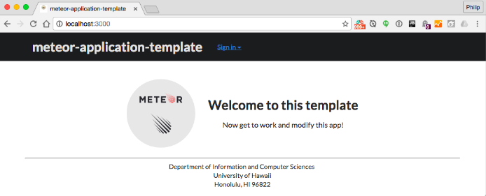

# How Meteor Got Me

Meteor is a popular open source platform for web, mobile, and desktop applications. It is great for beginning developers that are looking to take a dive into the world of fullstack development. Not only does Meteor allow the collaboration of front-end frameworks such as [Semantic UI](semantic-ui.com) but it also supports [MongoDB](https://www.mongodb.com/), a very popular NoSQL database. Although Meteor does sound like a walk in the park compared to other high-level open source platforms, it may be daunting for first-time developers as well as developers looking to intergrate a platform like Meteor with things like IntelliJ and ESLint or even beginners to Node.js. This essay highlights some of the common problems I have had with my early exposure to Meteor and how I managed to solve them.

## Starting a Meteor Shower
Setting up a Meteor project is relatively easy given the default templates and code from creating a Meteor project with the ```meteor npm install``` command-- something that is very common when working with developer frameworks that use the Node Package Manager like [React](https://facebook.github.io/react/) or [Ionic](https://ionicframework.com/). This of course could be a hassle when working on a Windows machine. From personal experience, I have seen that doing any software development-related work that does not require the use of Microsoft Visual Studio is better on a Mac vs. a Windows machine. This idea should hold true for Linux as well. 
<br><br>
One problem that I had to overcome while using a Windows based system was how my ```npm``` related commands didn't work. This can be easily solved by using the Windows Powershell command line instead of using the standard cmd. This should not be a problem for the Mac Terminal.
<br><br>
Breaking away from the standard Meteor project setup, in my ICS 314 Software Engineering class at UH Manoa, a recent class assignment called [Digits](http://courses.ics.hawaii.edu/ics314s17/morea/meteor-2/experience-meteor-digits-1.html) required the use of a [Meteor Application Template](http://ics-software-engineering.github.io/meteor-application-template/) provided by my ICS 314 professor. <br><br>

This Meteor Application Template comes with a standard directory layout, a standard set of Meteor packages, simple authorization/authentication and use of setting files for initialization, and quality assurance tools that uphold to industry standards. These are nice and it is easy to make changes to this template if a student or developer is well versed in the structure of Meteor or standard Software Engineer projects. Seeing how much content is in this template means that there are a lot of things a person would have to commit during their first commit.<br><br>

## Do not ignore .gitignore
The first commit I had when working with this template was over 3000 files and took over a hour to finish. This is a huge problem. Not only because of the time it took to do my first commit but also how much time I wasted on this problem when I should have not ignored the ```.gitignore``` file included in the template. <br><br>
Within my two or so years of using Github, I have never paid attention to ```.gitignore``` files until now. The purpose of ```.gitignore``` files is that it is a file that tells Github about the things it does not need to commit. After including the ```.gitignore``` file included in the Meteor Application Template, I managed to make faster commits within 10-12 minutes for the first commit (averaging 308-309 small files for that initial commit).<br><br>
To solve this problem using the ICS Software Engineering Meteor Application Template is easy. Just make sure the ```.gitignore``` file is properly copied. The ICS Software Engineering Meteor Application Template should come with a ```.gitignore``` file, but if it is not seen in the .zip file, then the user needs to readjust his or her view settings in their OS to see hidden ```.``` files. 
<br><br>
Long story short, don't ignore .gitignore. Especially when it is included in a template.
