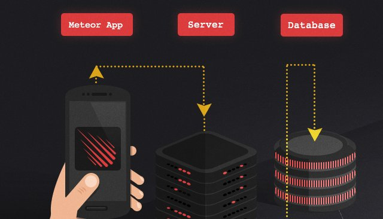

# Meteor Shower 
For the past few weeks, I have been struck by many small bodies of matter from outer space that enters the earth’s atmosphere, becoming incandescent as a result of friction and appearing as a streak of light. <br><br>
Okay-- I am over exaggerating. The small body of matter was not from outspace but from cyberspace. Also, it didn't enter the earth's atmosphere, it entered my Macbook via the ```meteor npm install``` command.  

## What is Meteor
Meteor is a popular open source platform for web, mobile, and desktop applications. It is great for beginning developers that are looking to take a dive into the world of fullstack development. Not only does Meteor allow the collaboration of front-end frameworks such as [Semantic UI](semantic-ui.com) but it also supports [MongoDB](https://www.mongodb.com/), a very popular NoSQL database. Although Meteor does sound like a walk in the park compared to other high-level, open-source platforms, it may be daunting for first-time developers as well as developers looking to intergrate a platform like Meteor with things like IntelliJ and ESLint or even beginners to Node.js. Personally, I have found Meteor to be easier than [React](https://facebook.github.io/react/) or [AngularJS](https://angularjs.org/).

## Starting a Meteor Shower
Setting up a Meteor project is relatively easy given the default templates and code from creating a Meteor project with the ```meteor npm install``` command-- something that is very common when working with developer frameworks that use the Node Package Manager like React and AngularJS. This of course could be a hassle when working on a Windows machine. From personal experience, I have seen that doing any software development-related work that does not require the use of Microsoft Visual Studio is better on a Mac vs. a Windows machine. This idea should hold true for Linux as well since Linux is kinda like Mac when it comes to things like this. 

## Meteors are hard to see from a window
Having a Windows based system was definitely a struggle. It was extremely difficult and irritating to see how my ```npm``` related commands didn't work on my HP Laptop. After hours of racking my head, I found that this issue I was having can be easily solved by using the Windows Powershell command line instead of using the standard cmd. This should not be a problem for the Mac Terminal-- Luckily, I have a Mac. Being able to install everything from the Terminal is definitely a blessing. 
<br><br>
There is definitely a learning curve when it comes to any open source platform. Some may be easy and straightforward, some may lack the proper documentation, and some may be just hard to install. Failed installations and missing dependencies are definitely a pet-peeve of mine and it sometimes deters me from learning a framework or technology-- However, being able to see a proper "run" or "compile" operation is definitely a reward in itself. 

<br><br>

## Do not ignore .gitignore
The first commit I had when working with Meteor and a template my ICS 314 professor provided was over 3000 files and took over a hour to finish. This is a huge problem. Not only because of the time it took to do my first commit but also how much time I wasted on this problem when I should have not ignored the ```.gitignore``` file included in the template. <br><br>
Within my two or so years of using Github, I have never paid attention to ```.gitignore``` files until now. The purpose of ```.gitignore``` files is that it is a file that tells Github about the things it does not need to commit. After including the ```.gitignore``` file, I managed to make faster commits within 10-12 minutes for the first commit (averaging 308-309 small files for that initial commit).<br><br>
Long story short, don't ignore .gitignore. Especially when it is included in a template that you forgot to copy. Using something as jam-packed as Meteor definitely taught me the importance of things like ```.gitignore``` and other project management-related files. 

## Meteor is out of this world!

One of the benefits to Meteor is definitely the amount of learning someone can get from using it. By learning Meteor, one can learn how to use MongoDB (the LEAD in NoSQL databases today). Honestly, there is probably no better and easier way to learn MongoDB than to use Meteor. This is definitely one of the highlights of Meteor because learning MongoDB seperately and trying to understand the concept of [MiniMongo](https://www.meteor.com/mini-databases) could be hard for someone to wrap their head around with if they are trying to learn it individually. My logic is: "Why not get more bang for your buck?"<br><br>
Meteor is free of course, but by learning Meteor someone could also learn MongoDB at the same time. This is definitely amazing for someone like me who does not have a lot of time on his hands. Plus having a good ICS 314 professor that provides a fantastic set of resources and documentation on both Meteor and MongoDB is a huge help as well. (I hope you're reading this, Dr. Johnson!) <br><br>
Another small thing I would like to note is that now that I understand how to use Meteor to its near-full capacity, I can take my knowledge, experience, and ability to debug things to another framework such as React or AngularJS. (Except Meteor can allow me to manipulate both the front-end and back-end whereas other frameworks do not).<br><br>

## Going from a Meteor to a Meteor Shower
Meteor is a hip and modern client-server application architecture. My first impressions of Meteor was definitely overwhelming. There was a lot of things that had to be put in for a functioning app and a lot of work to be done across multiple files that all had a significant amount of influence in how the final application would turn out. <br><br>
Luckily, I did not have any dramatic problems in my Meteor journey and once I continued to work on Meteor assignment by Meteor assignment, this build up of Meteors became a Meteor shower and I was starstruck by how intuitive Meteor was. <br><br>
Meteor is a great platform for anyone who wants to learn how to create web applications in a quick and efficient way. While it may be frustrating to see build errors every now and then, the ability to build quick and efficent mockups with Meteor can allow software developers to roll out a quick product at a hackathon and build on it later for startup funding (well that's how the lead Software Engineer did it at my last internship at Ditto at least).<br><br>
There are a lot of back and forth in the online community about the effectiveness and [viability of Meteor](https://medium.com/@edoardo849/meteor-angular2-and-react-once-the-dust-settles-528aa9b58e04#.upshee4ga) in today's changing world, but as an ICS 314 student, I see that Meteor is definitely something that is worth learning or trying. The use of Meteor in ICS 314 has definitely helped a lot of students who have not taken a SQL class be able to create database-backed web applications easily without the need to formally create a table in MySQL or Microsoft SQL Server.<br><br>
So yeah, Meteor was pretty g. 
