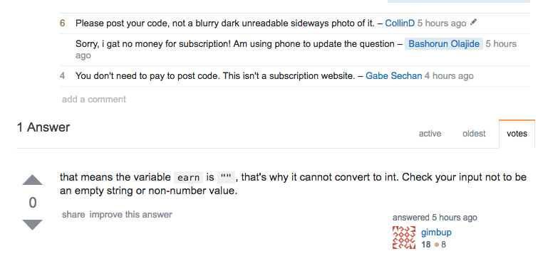

## What is Stack Overflow?

[Stack Overflow](http://stackoverflow.com/) is the largest online community of programmers to learn and share knowledge. 
Throughout the years, Stack Overflow has been a forum for computing discussions and a place where programmers can consult other programmers on insight for a specific problem. 
Almost every programmer programming in 21st-century knows about Stack Overflow. Although it is an extremely useful resource for directions and guidance on how to solve a specific problem, 
many programmers-- both old and new-- can take advantage of this site and think of it as a "helpdesk" service.
Programmers shouldn't feel like posting their question on Stack Overflow entitles them to an answer to their problem and they shouldn't feel like posting their questions can be solved "magically" by posting it on Stack Overflow. 
Learning how to as effective and "smart" questions is a useful skill to have for both software engineering and life. 

## What is a "Smart" Question?

I have had teachers and professors said to the class that "There's no such thing as a stupid question." 
After reading an essay on smart questions by Eric Steven Raymond about [Smart Questions](http://www.catb.org/esr/faqs/smart-questions.html), I feel like that
statement is true today. There are no such thing as a stupid question-- Because the only questions that should be asked are "smart" questions! 

### So what is a "smart question?"
To put it simply, a smart question on Stack Overflow and any programming-relate forum is one that accomplishes all of the following:
 
-Throughly checked 
 
Before you asking a question, you should have taken the initiative to solve it yourself and checked online resources-- Otherwise you may be ignored or subjected to rather rude responses.  
 
-Put on the correct forum 
 
Questions that are put on the wrong board or category are highly likely to be ignored. Plus, you wouldn't want to ask something like: "What medication should I take for backpain?" to a chef as opposed to asking a doctor. 
 
-Uses a meaningful, clear subject header
 
Make sure your question is clear and concise. A good example of this would be something that highlights an issue on a specific platform or framework as opposed to "HELP! Program doesn't work." A subject header should be clear and meaningful so that the reader can have some thoughts regarding the problem before reading the full story. 
 
-Easy to access and informative
 
When asking a question regarding a software or hardware issue, it is important to include the section of code that is causing the error or the machine configurations. It is also good to mention what goals or requirements that you are trying to fulfill. Allowing someone to see your code makes it easier for him or her to diagnose the problem. You can't expect someone to fix a car if they can't see what's under the hood. 

## An example of a smart question

 
 
[This question](http://stackoverflow.com/questions/11227809/why-is-it-faster-to-process-a-sorted-array-than-an-unsorted-array/11227902#11227902) was taken from Stack Overflow and asks why is it faster to process a sorted array vs an unsorted array. This is a smart question for many reasons:  
1) Because the subject header is clear and concise about what the problem is.  
2) The original poster took the initiative to do some research on testing on his or her side. Both in C++ and Java.  
3) Also note that it is on the correct type of forum and has the correct tags: "C++" and "Java"  
4) The poster's code is clearly visible and well-documented to explain his or her thought process. It also allows for others to toy with the poster's code and report back their observations and findings. 
 
What is interesting about this questions is that it yielded many responses and smart answers:   

 
### Why does this have smart answer?
Many answers, especially the most up-voted answer, accomplishes a variety of different things in this thread.   
1) The answers to this question provides reasoning. Aside from saying (branch prediction)[https://en.wikipedia.org/wiki/Branch_predictor] is the reason for why processing speed for arrays are different, the top-rated answer also explains the phenomenon in laymans terms before going to the actual code and logic behind branch prediction.  
2) The answers to this question often gives alternative solutions and test cases as to how performance can differ from unsorted arrays and sorted arrays. These are smart answers because they allow the question poster to dig deeper and research this topic further.  
 
Overall, this question was fantastic. Not only was it clear and provided some insight into what the person who asked that question was thinking but it also gave room for discussion. I believe that the person who asked the question definitely got a lot more information than he or she expected and so did others who were curious about the subject of branch prediction.
  
With that being said, let's look at a "not-so-smart" question... 

## An example of a "not-so-smart" question

[Here](http://stackoverflow.com/questions/41883036/still-getting-fatal-exception-after-many-code-i-have-tested) is a not-so-smart question. At first glance, what can we tell from this question? Based from what I can decipher from the header, the program doesn't work. Aside from the fact that the question is tagged "Java" and "Android," we can't tell much from it. 
 
So why isn't it a smart question?
 
1) Obviously the header is horrible. The header mentions fatal exception but does not go to explain which exception is causing the problem.  
2) The code. Instead of using typing actual code, the question poster attached two pictures of the code... On his or her computer screen... Taken from a phone.  
Not only is this highly unprofessional but the fact that ONE OF THE PICTURES ARE SIDEWAYS implies that fact that the question poster is not even serious about the work he or she is doing. Posts like these are often ignored and flamed on. 
3) The background info. Although we can see that the question poster is doing work in Java and Android Studio, even with our heads rotated to the left, we still do not have enough information to diagnose the problem. We know that it is a fatal error but which one? Which Android Studio version is he or she using? What is he or she trying to do or make?  
It's vagueness like this that detracts people from commenting which prevents the problem from being solved. 
  
It's questions like these that lead to "not-so-smart" answers.

### An example of "not-so-smart" answers
Why are these answers not the best? Well, to be frank, the question poster kind of had these coming to him or her when he or she decided to post two actual photos of the code vs. copy-pasting it to the question or taking a screenshot.  
  So why are these answers and replies not-so-smart?  
1) The first reason is the only attempt to solve the problem is unclear. Sure this error might be caused by one variable bug, but the person who answered this did not give the question poster any insight to fix this problem or prevent this problem from happening again in the future. It just implies to the question poster that there will always be someone on Stack Overflow to give him or her an answer.  
2) Based on the question poster's reply, it seems that he or she thinks Stack Overflow is a helpdesk service. Again, the question posted had it coming to him or her but the fact that he or she thinks that you need to pay a subscription is beyond me. The question poster mentioning that ended up with 2/3 people that made any attempt at communication to leave and not make any further interaction.  
 
## So what? 
The goal of this essay is to not say that one way of asking a question is better than the other, but to provide insight on what types of questions are "smart" questions that are likely to generate some discussion and solution.  
The goal of a question poster should not be to get an answer and move on-- No. It should be a learning experience that he or she can build on and become stronger in the future.   
Those answering questions should not go directly to the answer but rather provide some insight on the problem and explain why the issue is happening help the question poster to grow and study up on a concept or problem that he or she needs to learn more about.   
After browsing questions of both the "smart" and "not-so-smart" range based on Eric Steven Raymond's methodogy, I believe that I learned how to be more clear and concise about the questions I ask in the future. 
## So how does this relate to Software Engineering? 
It is imperative for software engineers to be able to ask questions in a "smart" way. Being clear and concise about the question while showing initiative to diagnose the root of the problem is a valuable skill to have. As a person who believes in user-centered design, I think it is important for engineers to communicate effectively about software and hardware and being able to explain a problem to someone is part of it.  
You can't expect a doctor to fix you if you can't tell him what's wrong. 
