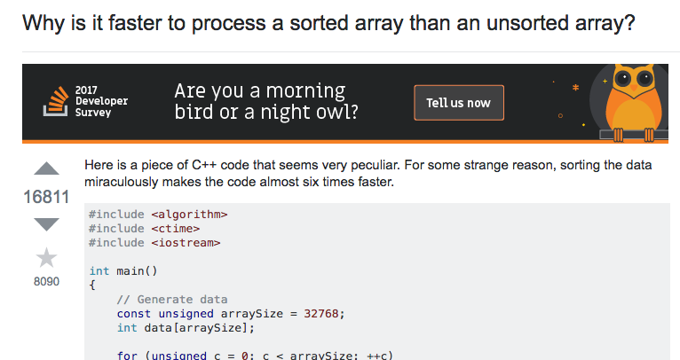

## What is Stack Overflow?

[Stack Overflow](http://stackoverflow.com/) is the largest online community of programmers to learn and share knowledge. 
Throughout the years, Stack Overflow has been a forum for computing discussions and a place where programmers can consult other programmers on insight for a specific problem. 
Almost every programmer programming in 21st-century knows about Stack Overflow. Although it is an extremely useful resource for directions and guidance on how to solve a specific problem, 
many programmers-- both old and new-- can take advantage of this site and think of it as a "helpdesk" service.
Programmers shouldn't feel like posting their question on Stack Overflow entitles them to an answer to their problem and they shouldn't feel like posting their questions can be solved "magically" by posting it on Stack Overflow. 
Learning how to as effective and "smart" questions is a useful skill to have for both software engineering and life. 

## What is a "Smart" Question?

I have had teachers and professors said to the class that "There's no such thing as a stupid question." 
After reading an essay on smart questions by Eric Steven Raymond about [Smart Questions](http://www.catb.org/esr/faqs/smart-questions.html), I feel like that
statement is true today. There are no such thing as a stupid question-- Because the only questions that should be asked are smart questions! 

### So what is a "smart question?"
To put it simply, a smart question is one that fits in all of the following:
<br>
-Throughly checked 
<br>
Before you asking a question, you should have taken the initiative to solve it yourself and checked online resources-- Otherwise you may be ignored or subjected to rather rude responses.  
<br>
-Put on the correct forum 
<br>
Questions that are put on the wrong board or category are highly likely to be ignored. Plus, you wouldn't want to ask something like: "What medication should I take for backpain?" to a chef as opposed to asking a doctor. 
<br>
-Uses a meaningful, clear subject header
<br>
Make sure your question is clear and concise. A good example of this would be something that highlights an issue on a specific platform or framework as opposed to "HELP! Program doesn't work." A subject header should be clear and meaningful so that the reader can have some thoughts regarding the problem before reading the full story. 
<br>
-Easy to access and informative
<br>
When asking a question regarding a software or hardware issue, it is important to include the section of code that is causing the error or the machine configurations. It is also good to mention what goals or requirements that you are trying to fulfill. Allowing someone to see your code makes it easier for him or her to diagnose the problem. You can't expect someone to fix a car if they can't see what's under the hood. 

### Here is an example of a smart question

<br>
<br>
[This question](http://stackoverflow.com/questions/11227809/why-is-it-faster-to-process-a-sorted-array-than-an-unsorted-array/11227902#11227902) was taken from Stack Overflow and asks why is it faster to process a sorted array vs an unsorted array. This is a smart question for many reasons: <br>
1) Because the subject header is clear and concise about what the problem is. <br>
2) The original poster took the initiative to do some research on testing on his or her side. Both in C++ and Java. <br>
3) Also note that it is on the correct type of forum and has the correct tags: "C++" and "Java" <br>
4) The poster's code is clearly visible and well-documented to explain his or her thought process. It also allows for others to toy with the poster's code and report back their observations and findings. 
<br>
What is interesting about this questions is that it yielded many responses and smart answers: <br>

<br>
### Why is this a smart answers?


-end

Every programmer chooses to use a specific language for a reason whether it their level of comfort or the open-source libraries available for a specific language, so I won't make the argument of why one is better than the other. What I will talk about is how JavaScript is different to me. 

One of key comparisons that people make with JavaScript with how different it is to Java. The first thing that sticks out to me is declaring variables.

In Java, declaring a string and an integer looks like this:
<br>
```
int myInt = 10;
String myString = "This is Java.";
```
<br>
While doing the same thing in JavaScript looks like this: 
<br>
```
let myInt = 10;
let myString = "This is JavaScript."
```
<br>
Notice how in Java, the variables need to be specified as a String and an int while in JavaScript, we can use let for both a string and an integer. As a programmer who started off with C and Java, this is mindblowing (though I guess the people who started off with [Fortran](http://www.fortran.com/) felt the same way when they first tried Java). 

In a way, being able to declare variables like this is pretty cool because it allows the programmer to skip the small details and focus on the logic of their code. The only thing they would have to worry about is whether or not their variables are ``const`` (constants) or not. As a side note, you'll probably see a lot of JavaScript code online using ``var`` as opposed to ``const`` or ``let`` and this is can end up with errors in the long run according to the [AirBnB JavaScript guide](https://github.com/airbnb/javascript#types).

## JavaScript in ICS 314 (Software Engineering)

Although I have done work with JavaScript in the past by using several JavaScript-supported APIs, [ICS 314](http://courses.ics.hawaii.edu/ics314s17/index.html) was my first time formally learning the language in a classroom setting. From my first week in the class, I learned how to do a lot of new things in JavaScript such as creating an object and accessing its properties. Being able to quickly add a property to an object without making a new one with new parameters was also something new to me. 

In ICS 314, there is a WOD (Work Out of the Day) every week where students are challenged to code a solution to a problem within a certain amount of time-- something known as "Athletic Software Engineering." I enjoy doing WODs because it is good practice for future interviews and it gives me practice in a programming language I am learning. This style of learning may be a little stressful but it is enjoyable because it challenges me to understand a problem and find the best optimal solution-- much like those problems found on [LeetCode](https://leetcode.com/problemset/draft/) which sometimes show up on actual tech interviews. 

## Conclusion: Is JavaScript Good or Bad?

JavaScript is pretty great. The best part of it to me is being able to easily declare variables and access properties inside an object. JavaScript also has a variety of different uses from web development to game development. I remember an IBM recruiter at a career fair telling me to put JavaScript before Java on my resume because a lot of companies nowadays are looking for JavaScript. From a Software Engineering perspective, I feel that JavaScript has room to grow. It is a great language that can interact with other languages such as PHP and HTML. From my knowledge, I can't see anyone progamming applications to do things like contour detection or train a classifer but it seems to be getting on that level since people are doing things like [binding OpenCV](https://github.com/peterbraden/node-opencv) or making a [Deep Learning library](http://cs.stanford.edu/people/karpathy/convnetjs/). JavaScript is something I will definitely continue to learn.
