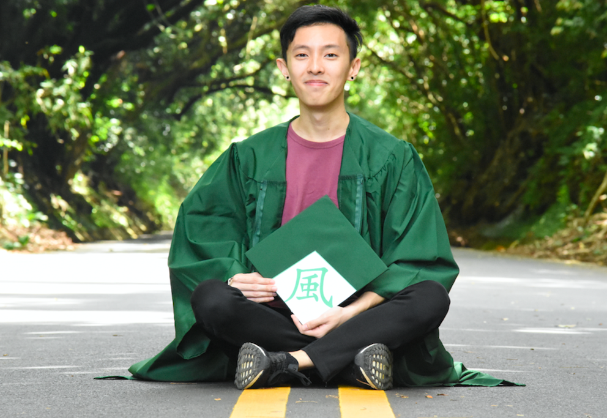
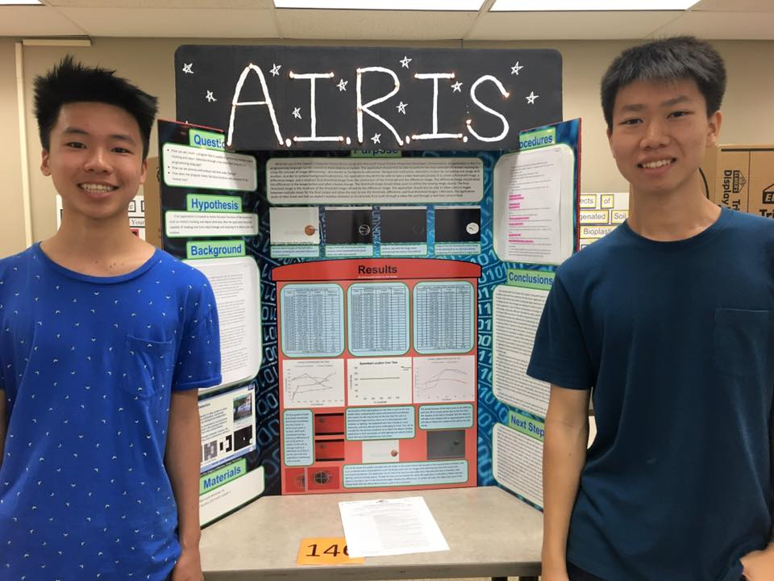

Hi! I'm Chris from Honolulu, Hawaii!
I graduated the University of Hawaii at Manoa with a major in Computer Science and minor in Business with focuses in Software Development and Project Managment.
Prior to joining IBM in the Bay Area, I worked under the NASA Space Grant Fellowship program and interned at many Hawaii tech companies and startups.

Aside from software and project management, my passion is STEM advocation.
Unlike Seattle and the Bay Area, there is a lack of Computer Science education resources in Hawaii.
I believe that coding is a 21st century skill that everyone should have access to.
As a result, I served as a STEM mentor for the Hawaii Department of Education where I got to collab with really cool teachers to develop Computer Science curricula and mentor students for the Honolulu District, Hawaii State, and Intel International Science Fairs.

 

  

    
Here's an image of my kids-- I mean, my mentees-- with their OpenCV Computer Vision science fair project (Best in Software @ 2016 Honolulu District Science Fair)

  

 
Aside from tech and STEM outreach, I love Japanese subculture, street fashion, and urban dance. Actually, my interest in urban dance happened when I stayed in UC Berkeley during my IBM internship and joined AFX (UC Berkeley's LARGEST dance organization).

  

    
I don't have any videos of me dancing, so here's one of my favorite dancers, Franklin Yu

  

 
Honestly, I really don't know what else to put on this About page. As of summer 2018, I'm still figuring a lot of stuff out--
Stuff regarding the future, adulting, where I see myself career-wise and relationship-wise in 10 years, what to eat for lunch, etc.

Anyway I hope you enjoy this site! (It's a WIP!)

