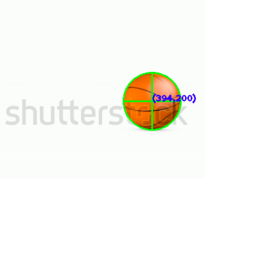
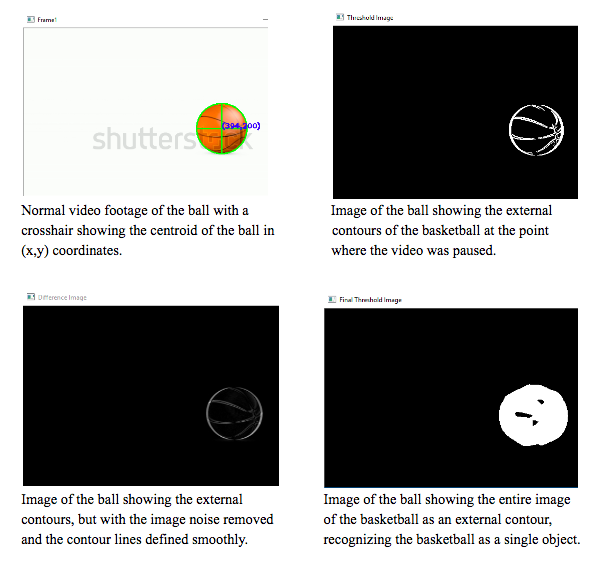

AIRIS is a C++ console application using the [OpenCV](http://opencv.org/) Computer Vision library to track motion in real time through a live-video feed through a camera or a normal video file. This project was a collaborative effort for me a STEM Resource Mentor for the Hawaii State Deparment of Education's [Kaimuki-McKinley-Roosevelt Complex Area](http://www.hawaiipublicschools.org/ConnectWithUs/Organization/OfficesAndBranches/Pages/Kaimuki-McKinley-Roosevelt.aspx).

As a mentor, I was tasked with teaching two high school students how to code in C++ and use the OpenCV library for this project. For the programming side, I constructed the basic framework to track motion using the concept of [image differencing](https://en.wikipedia.org/wiki/Image_differencing) and wrote data collection scripts.

To achieve real-time motion detection, image differencing is used to compare a current frame to a previous frame.
If the current frame is different from the previous frame then there is indeed movement.

This project won Best of Systems Software at the 2016 Honolulu District Science and Engineering Fair and was nominated to attend the Intel Science and Engineering Fair. After the 2016 Honolulu District Science and Engineering Fair, I worked with my mentees to apply this image differencing algorithm to leukemia detection for the 2016 Hawaii State Science and Engineering Fair-- which resulted in this project receiving the Department of Computer Sciences Award and Third Prize in Systems Software.

This project gave me the opportunity to improve my ability to teach C++ to students with no programming knowledge and work with a different age group. Learning well enough to teach others has always been a "mantra" of mine and by doing so, I became a better programmer. I definitely believe that high school students are capable of learning Computer Science.

 

 
 

This project and my mentees were also featured on Hawaii News Now on Sunrise for the [March 11](http://www.hawaiinewsnow.com/story/31448254/students-discuss-their-entries-in-the-hawaii-state-science-and-engineer-fair) airing and the [March 22](http://www.hawaiinewsnow.com/story/31539501/interview-hawaii-state-science-engineering-fair) airing.

If you want to learn more about this project, please check out this Github link below!

Source: <a href="https://github.com/chrisnguyenhi/airis"><i class="large github icon"></i>AIRIS</a>
