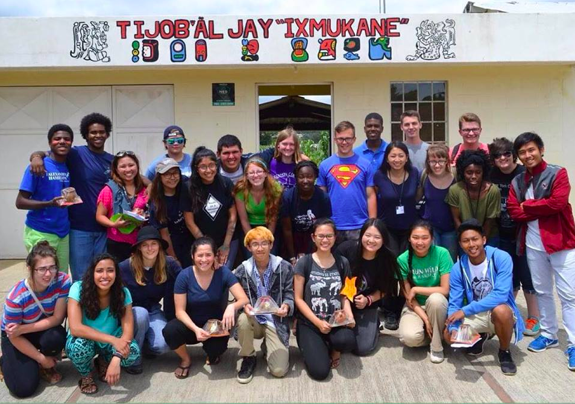
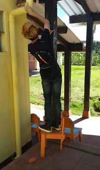
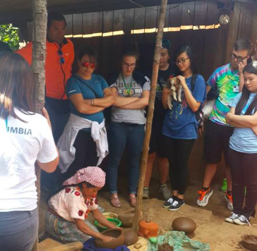

During the summer of 2015, I participated in International Leader Week 2015, a one week community service trip in Tecpan, Guatemala courtesy of [Alexander Hamilton Scholars](http://hamiltonscholars.org/1/).
This service trip was hosted by [Cross-Cultural Solutions](https://www.crossculturalsolutions.org/), a organization which allows people from the United States of America to volunteer internationally. 
From International Leader Week, I learned how to embrace other cultures, overcome a language barrier (I spoke no Spanish), and work with a diverse group of Hamilton Scholars from all around the nation. 
I also got beat in soccer by 2nd graders. 

Alexander Hamilton Scholars is a scholarship that I won in my junior year of high school in 2013. Since then, they have activity support me and 25+ other winners (or Hamilton Scholars) throughout the college transition process since many of us are first-generation college students. 
The Year 1 program in the summer of 2014, Seattle Leader Week, focused on transitioning to college and financial aid. This Year 2 program in Guatemala focused on cultural diversity and service.
Within the one week I was in Guatemala with my Hamilton Scholar cohort, we were able to work together to repaint an entire school in Tecpan.

Aside from repainting the school, International Leader Week also consisted of going to Mayan Ruins, seeing Guatemalan art, and understanding the wealth disparity and corruption in Guatemala. 
Guatemalan language, Kaqchlcal, is slowly being loss due to the importance that Spanish and English plays in providing opportunites. As a result, many Guatemalan children of Mayan descent grow up without learning it at all.
International Leader Week was an eye-opening experience and taught me to be appreciative of everyday things such as running water or electricity-- something that many who live in first-world countries take for granted.
