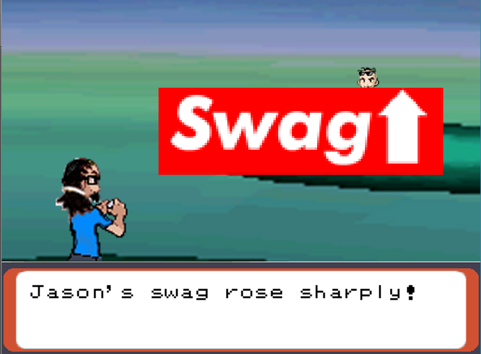
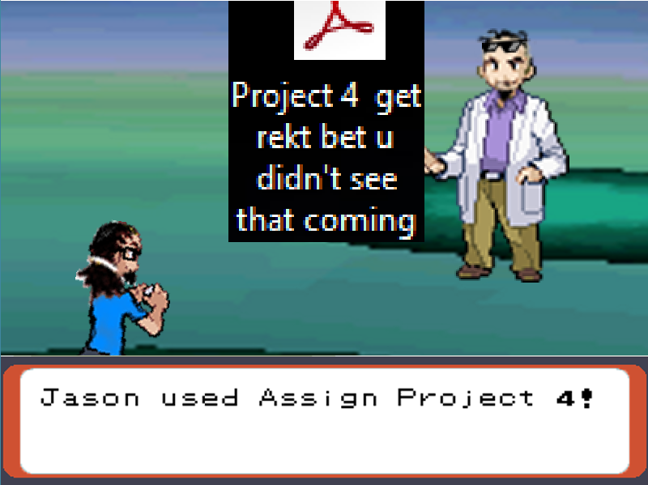

 

Jason vs. Dylan is a Java project that creates an animation based on instructions off a text file. The characters were based off of my ICS 111 (Intro to Programming I) professor and teaching assistant. The graphics were implemented using [EZ](http://www2.hawaii.edu/~dylank/ics111/) library provided by ICS 111 class. 

The cnguyen7_animator class reads off commands from .txt files under the convention of "command numbervalue duration" based on selected function for the EZImage class in the EZ library. For each command there could be multiple number values. For example "move 200 100 10" which is equivalent to ``translateTo(200,100)`` for the duration of 10 miliseconds.

In this project, I gained experience with using graphics and sound in Java as well as file scanning and text parsing. For more information and the code repository, please check out the Github link below! 
 
Source: <a href="https://github.com/chrisnguyenhi/JasonVSDylan"><i class="large github icon"></i>JasonVSDylan</a>
