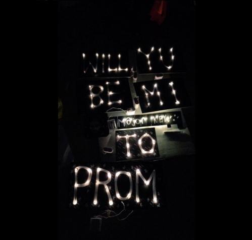

This project or rather, "mission" was to create a LED Prom Sign to ask out a girl named Yumi before prom contract agreements were due or before some other guy asks her out.
The LED Prom Sign was made through battery-powered LED Strings that were ran through paper boards to spell out "WILL YU BE MI Major Date TO PROM."
This LED Prom Sign was an inexpensive option as it only cost less than $20 to make within a short period of time. 

From this LED Prom Sign project, I learned how to apply basic geometry skills and papercraft to a real life problem under a limited amount of time-- Because literally, the prom contracts were due the day after.
In addition, I acquired basic planning skills because I had to assemble a team of individuals to trick her into going into my Chemistry teacher's classroom after her Student Government activities. 
It was also difficult to persuade my Chemistry teacher to stay afterschool till 5:00 PM but I made a compromise with her by signing myself up for the 2014 Physics Olympics.
Lastly, my most important accomplishment in this project other than Yumi saying "Yes" was using wordplay by incorporating "YU" and "MI" in place of "WILL YOU BE MY Major Date TO PROM" on the LED Signs. 
