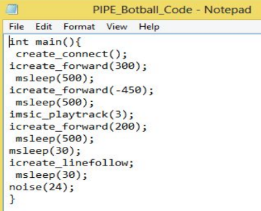

PIPE (Programming in Pure English) is a console application turns English langauge sentences and translates them into C for Botball robots. This project eventually won Best of Computer Science at the 2014 Honolulu District Science Fair and earned the Department of Information and Computer Sciences Award at the 2014 Hawaii State Science and Engineering Fair.

After a sentence is entered, the program translates keywords into commands using a dictionary of keywords associated with the [Botball C library](http://files.kipr.org/link/documentation/libkovan_docs/index.html) and creates a C file that is ready to run.
 

 

 
This was my first-ever programming project using the first programming language I learned. Now that I am I college junior, I feel that it was probably a bad idea for a high school junior to pick C as his first programming language to learn. It was definitely a huge learning curve from teaching myself how to program to creating an application that accomplishes a goal. 

What drove me to create PIPE was my desire to simplify programming for beginning programmers. I also wanted a cool demo with a robot at my booth so I decided to do something with a robot. From this high school science fair project, I had my first experience with Natural Language Processing (a popular topic in Computer Science) and learned basic C concepts such as if-statements, for-loops, pointers and I/O. 

Today, I am a proud Computer Science major at the University of Hawaii at Manoa and still continue to volunteer as a high school project judge and mentor high school students for [Hawaii Science Fairs](http://www.hawaiiacademyofscience.org/). 

I've definitely made a huge improvement as a programmer since this project in 2014. If you want to learn more about this project and my humble beginnings as a programmer without any formal Computer Science education, please check out the Github repo below! 

Source: <a href="https://github.com/chrisnguyenhi/pipe"><i class="large github icon"></i>PIPE</a>
