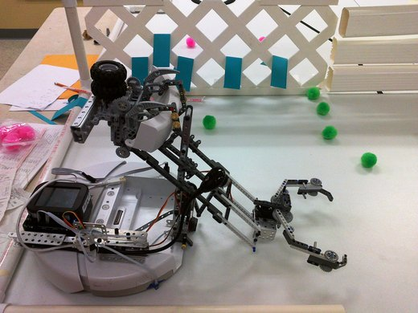
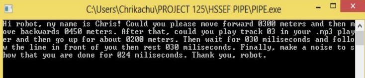

PIPE (Programming in Pure English) is a console application turns English language sentences into C for Botball robots.
This project won [Best of Computer Science](https://www.hawaiipublicschools.org/DOE%20Forms/HDO/Science%20Fair%202014.pdf) at the 2014 Honolulu District Science Fair and earned the [Computer Sciences Award](http://scifair-dev.weebly.com/uploads/2/1/4/7/21471206/list_of_winners_by_district.pdf) from the University of Hawaii at Manoa Department of Computer Sciences at the 2014 Hawaii State Science and Engineering Fair.

After a command is entered, the program scans for keywords mapped to selected commands in the [Botball](http://www.botball.org/) C library (based on the 2013 Student Developers Kit) and translates them into C file that is ready for Botball robots to run.
 
 

 
This was my first-ever programming project using the first programming language I learned. 
Now that I am real software developer, I feel that it was probably a bad idea for a high school junior to pick C as his first programming language.
It was definitely a huge learning curve from teaching myself how to program to creating an application that accomplishes a goal.

What drove me to create PIPE was my desire to simplify programming for beginning programmers.
From this high school science fair project, I had my first experience with Natural Language Processing (a popular topic in Computer Science) and learned basic C concepts such as if-statements, for-loops, pointers and I/O.
The learning curve of this project drove me to major in Computer Science in college and later volunteer as a Computer Science mentor for [Hawaii Science Fairs](http://www.hawaiiacademyofscience.org/) as a way of "giving back" to the things that lead me to where I am today.
I've definitely made a huge improvement as a programmer since high school.

If you want to learn more about this project and my humble beginnings as a programmer without any formal Computer Science education and bad code, please check out the Github repo below!

Source: <a href="https://github.com/chrisnguyenhi/pipe"><i class="large github icon"></i>PIPE</a>
