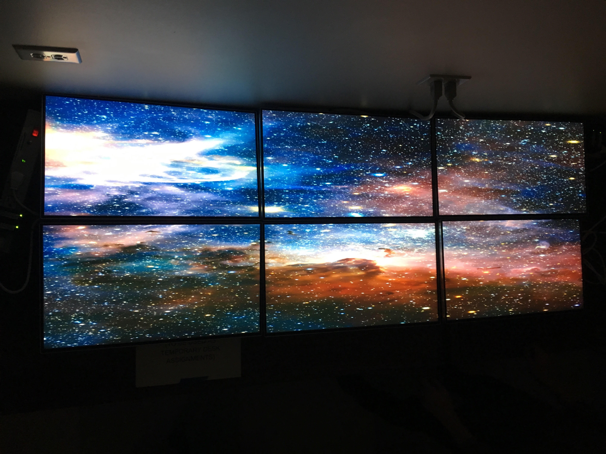
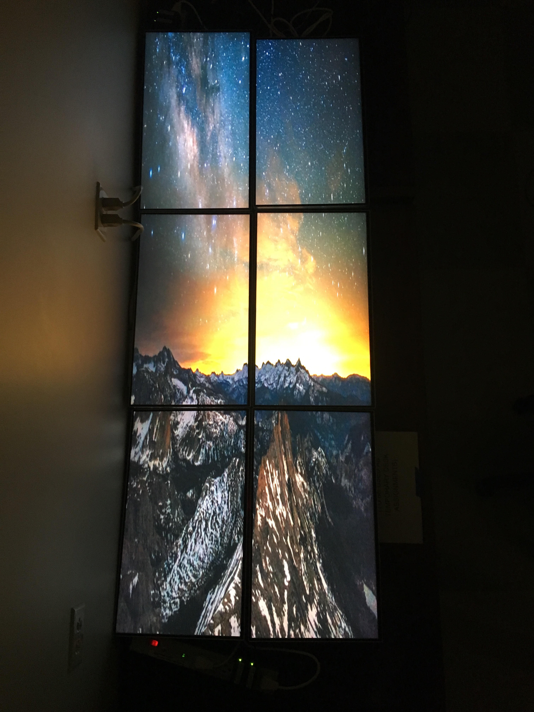

During my time as a Network and Security Intern at Oceanit, I created a relatively inexpensive, 72" automated video wall system 
using six LG 24" monitors and seven Raspberry Pis. This project allowed me to work with embedded systems such as the Raspberry Pi as well as networking hardware.
In addition, I gained more knowledge about Shell scripting and the idea of automation.

The software supporting this is PiWall, a open-source video wall software that allows Raspberry Pis to synchronize a video stream to a controller.
I configured the software to expand from a 4-Wall system to a 6-Wall one spanning 72" with automated scripts to turn on the entire system from a controller Pi
as opposed to turn every Pi on individually. 

To create this 72" display, the following materials were used: 
- Seven Raspberry Pis (Jessie OS or higher)
- Six 24" LG Monitors with 2.4mm Bezels
- One 8-Port Switch

 

 

In order to run a stable stream, all of the Raspberry Pis had to be connected to one network switch and be configured to run SSH.
After all of the Raspberry Pis installed the PiWall software, one Pi was designated as the "Controller" and held a activateController.sh file to send a broadcast signage to the other tile Pis.

Every Pi had a .piwall file that held the configuration for the size of the 72" system.
Each tile Pi held a .pitile file to define where it was in the video wall system and a playTile.sh script that allowed it to capture a stream from the controller Pi.

The controller Pi had an activateController.sh script that allowed it to broadcast the video stream across the network. 
Additionally, the controller Pi held a sshWall file that allowed the controller Pi to SSH into every individual tile Pi and run their own playTile.sh scripts.
Lastly, the controller Pi had a ActivateWall.sh script that enables the enter system to start playing on one-click. 

If you want to learn more about this project, please check out the github link below!

Source: <a href="https://github.com/chrisnguyenhi/pipe"><i class="large github icon"></i>PIPE</a>
